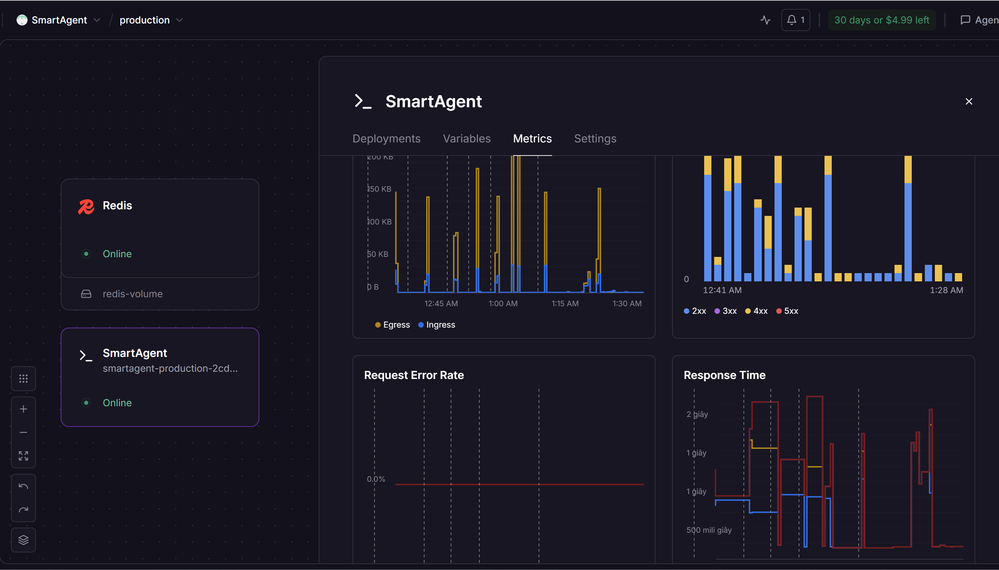
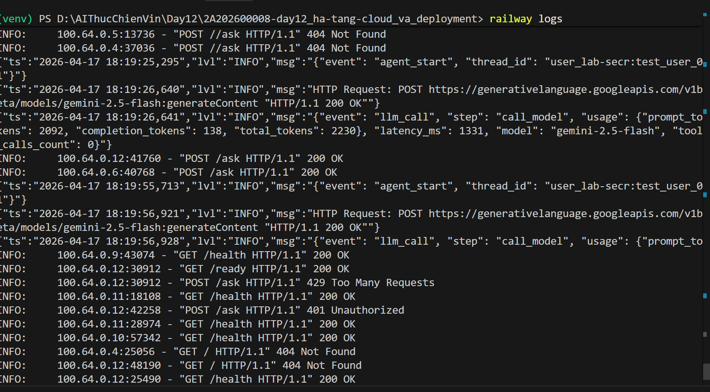

# Deployment Information

## 🚀 Public URL
https://smartagent-production-2cdd.up.railway.app

## 🛠️ Platform
Railway (with Docker + Redis Stack)

## 🔑 Authentication
- **Header**: `X-API-Key`
- **Value**: `lab-secret-key-123`

---

## 🧪 Test Commands

### 1. Health Check
Kiểm tra trạng thái hệ thống và uptime:
```powershell
PS D:\AIThucChienVin\Day12\2A202600008-day12_ha-tang-cloud_va_deployment> curl.exe https://smartagent-production-2cdd.up.railway.app/health
{"status":"ok","uptime":992.0,"version":"1.0.0"}
```

### 2. Authentication Test
Kiểm tra tính bảo mật (kỳ vọng trả về 401 Unauthorized nếu thiếu Key):
```powershell
curl -X POST https://smartagent-production-2cdd.up.railway.app/ask `
  -H "Content-Type: application/json" `
  -d "{\"question\": \"Hello\"}"
```
Output:

```
PS D:\AIThucChienVin\Day12\2A202600008-day12_ha-tang-cloud_va_deployment> curl.exe -X POST "$URL/ask" `
>>   -H "Content-Type: application/json" `
>>   -d "{\`"user_id\`": \`"test_user_01\`", \`"question\`": \`"Hello\`"}"           
{"detail":"Invalid or missing API key."}
```

### 3. Conversation History (Stateless Redis)
Kiểm tra khả năng ghi nhớ thông qua Redis (Sử dụng `session_id` để định danh hội thoại):

* Giới thiệu tên Alice
```powershell
PS D:\AIThucChienVin\Day12\2A202600008-day12_ha-tang-cloud_va_deployment> curl.exe -X POST "$URL/ask" `
>>   -H "X-API-Key: $KEY" `
>>   -H "Content-Type: application/json" `
>>   -d "{\`"user_id\`": \`"test_user_01\`", \`"question\`": \`"My name is Alice\`"}"          
{"session_id":"default_session","answer":"It's lovely to meet you, Alice! I'm your Smart Travel Assistant, and I'm here to help you with all your travel needs.\n\nHow can I assist you today, Alice? Are you looking for some travel inspiration, perhaps information about flights, hotels, or even currency exchange rates? Just let me know!","timestamp":"2026-04-17T18:20:29.597242+00:00"}
```
* Hỏi lại tên Alice
```powershell 
PS D:\AIThucChienVin\Day12\2A202600008-day12_ha-tang-cloud_va_deployment> curl.exe -X POST "$URL/ask" `
>>   -H "X-API-Key: $KEY" `
>>   -H "Content-Type: application/json" `
>>   -d "{\`"user_id\`": \`"test_user_01\`", \`"question\`": \`"What is my name?\`"}"          
{"session_id":"default_session","answer":"Your name is Alice! It's nice to chat with you again.\n\nHow can I help you with your travel plans today, Alice?","timestamp":"2026-04-17T18:20:47.915777+00:00"}
```

### 4. Rate Limiting
Kiểm tra giới hạn 10 requests/phút. Nếu gửi quá nhanh, hệ thống sẽ trả về lỗi **429 Too Many Requests**.

### 5. Screenshot



---

## 🏗️ Architecture Summary
- **FastAPI**: Stateless API layer.
- **LangGraph**: Orchestration framework for the AI Agent.
- **Redis Stack**: Global persistence layer for checkpointing (conversation history).
- **Docker**: Containerized deployment with non-root security.
- **Railway**: Cloud hosting with automatic horizontal scaling.
