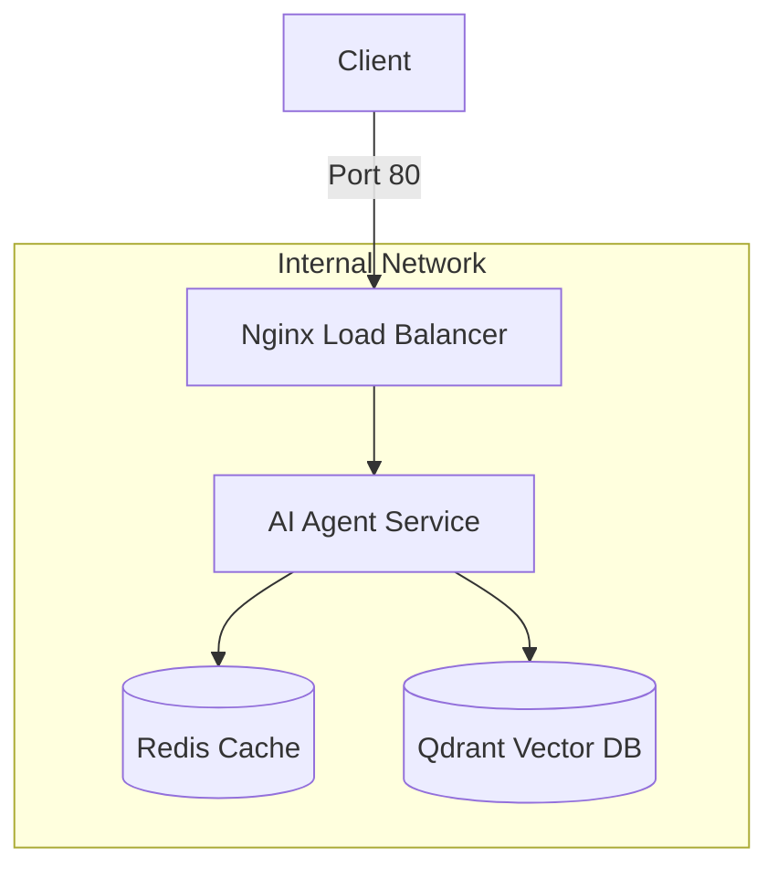

# Day 12 Lab - Mission Answers

## Part 1: Localhost vs Production

### Exercise 1.1: Anti-patterns found
1. API key hardcode trong code: `OPENAI_API_KEY = "sk-hardcoded-fake-key-never-do-this"`. Nếu push lên GitHub là bị lộ secret.
2. Không có config management: Các biến như `DEBUG`, `MAX_TOKENS` bị fix cứng trong code, không linh hoạt theo environment.
3. Print thay vì proper logging: Log thông tin ra console bằng `print()`, thậm chí log cả API key (secret) ra log.
4. Không có health check endpoint: Platform không biết trạng thái của agent để tự động restart nếu app bị treo/crash.
5. Port cố định & Binding local: Cố định `port=8000` và `host="localhost"`. Khi deploy cần đọc port từ env var và bind `0.0.0.0`.

### Exercise 1.3: Comparison table
| Feature | Develop | Production | Why Important? |
|---------|---------|------------|----------------|
| Config  | Hardcode trong file code | Environment variables (via `.env` & Pydantic) | Bảo mật secret và linh hoạt thay đổi config mà không cần sửa code. |
| Health check | Không có | Có endpoint `/health` và `/ready` | Để container orchestrator tự động giám sát và restart nếu app lỗi. |
| Logging | Dùng `print()` đơn giản | Structured JSON logging | Dễ dàng parse và quản lý log tập trung; tránh rò rỉ secret vào log. |
| Shutdown | Tắt đột ngột | Graceful shutdown (SIGTERM handler) | Hoàn thành các request đang dở và đóng connection sạch sẽ trước khi terminate. |

## Part 2: Docker

### Exercise 2.1: Dockerfile questions
1. Base image: `python:3.11` (Đây là full Python distribution).
2. Working directory: `/app` (Thiết lập thư mục làm việc chính cho container).
3. Tại sao COPY requirements.txt trước? Để tận dụng **Docker layer cache**. Nếu code thay đổi nhưng dependencies không đổi, Docker sẽ reuse layer cũ thay vì phải chạy lại `pip install`, giúp build nhanh hơn.
4. CMD vs ENTRYPOINT khác nhau thế nào? `ENTRYPOINT` xác định lệnh chính không thể thay đổi của container, còn `CMD` cung cấp các tham số/lệnh mặc định có thể dễ dàng bị ghi đè khi chạy lệnh `docker run`.

### Exercise 2.3: Image size comparison
- Develop: 1.66 GB
- Production: 236 MB
- Difference: ~85.8% reduction

**Tại sao image Production nhỏ hơn?**
1. **Base Image**: Bản develop dùng `python:3.11` (đầy đủ, nặng ~1GB), trong khi production dùng `python:3.11-slim` (tối giản, chỉ chứa những gì cần để chạy Python).
2. **Multi-stage build**: Tách biệt quá trình build và runtime. Stage builder cài các công cụ nặng (gcc, build-essential) để biên dịch thư viện, nhưng Stage runtime chỉ copy kết quả cuối cùng, loại bỏ hoàn toàn các file rác và công cụ build.
3. **Dọn dẹp**: Production Dockerfile xóa cache apt (`rm -rf /var/lib/apt/lists/*`) và dùng `--no-cache-dir` khi install pip.### Exercise 2.4: Docker Compose stack

**Architecture Diagram:**


**Services được start:**
1. **agent**: AI Agent (FastAPI) xử lý logic chính.
2. **redis**: Lưu trữ session và hỗ trợ rate limiting.
3. **qdrant**: Vector Database dùng cho các tác vụ RAG (Retrieval-Augmented Generation).
4. **nginx**: Đóng vai trò Reverse Proxy và Load Balancer, là cổng vào duy nhất từ internet.

**Cách chúng communicate:**
- **External to Internal**: Client gửi request qua port 80 tới Nginx.
- **Internal Routing**: Nginx chuyển tiếp request tới các instance của service `agent`.
- **Service-to-Service**: Agent kết nối tới Redis và Qdrant thông qua tên của service (Docker DNS tự động phân giải IP).
- **Isolation**: Tất cả các service giao tiếp trong network `internal`, giúp ẩn các database (Redis, Qdrant) khỏi internet để bảo mật.

## Part 3: Cloud Deployment

### Exercise 3.1: Railway deployment
- URL: https://deployrailway-production-e1a3.up.railway.app/
- Screenshot: [Link to screenshot in repo]

**So sánh `railway.toml` vs `render.yaml`:**

| Feature | `railway.toml` | `render.yaml` |
|---------|-------------------------|--------------------------------|
| **Định dạng** | TOML | YAML |
| **Phạm vi (Scope)** | Thường cấu hình cho **một** service cụ thể. | Cấu hình cho **toàn bộ stack** (Web, Redis, DB, Disk...). |
| **Cơ chế Build** | Ưu tiên dùng `Nixpacks` để tự động nhận diện ngôn ngữ/môi trường. | Cần định nghĩa rõ `runtime`, `buildCommand`, và `startCommand`. |
| **Quản lý Env** | Thường set qua Dashboard hoặc CLI (`railway variables set`). | Liệt kê tường minh trong file, hỗ trợ tự sinh giá trị (`generateValue`). |
| **Infrastructure as Code** | Mức độ cơ bản. | Rất mạnh mẽ, định nghĩa được cả cụm hạ tầng phức tạp. |

## Part 4: API Security
### Exercise 4.1: API Key authentication
```
C:\Users\admin>curl "http://localhost:8000/ask?question=Hello" ^
More?   -X POST ^
More?   -H "X-API-Key: demo-key-change-in-production" ^
More?   -H "Content-Type: application/json"
{"question":"Hello","answer":"Tôi là AI agent được deploy lên cloud. Câu hỏi của bạn đã được nhận."}

C:\Users\admin>curl http://localhost:8000/ask -X POST ^
More? More?   -H "Content-Type: application/json" ^
More? More?   -d "{\"question\": \"Hello\"}"
{"detail":"Missing API key. Include header: X-API-Key: <your-key>"}
```
### Exercise 4.2: JWT Authentication
**JWT Flow:**
1. User gửi credentials (username/password) tới `/auth/token`.
2. Server xác thực và trả về JWT token (chứa username, role, expiry).
3. User gửi JWT trong header `Authorization: Bearer <token>` cho các request sau.
4. Server giải mã token để lấy thông tin user mà không cần truy vấn database mỗi lần.

**Test results:**
- Login thành công cho user `student`.
- Gọi `/ask` với token thành công:
```json
{
  "question": "What is JWT?",
  "answer": "Đây là câu trả lời từ AI agent (mock). Trong production, đây sẽ là response từ OpenAI/Anthropic.",
  "usage": {
    "requests_remaining": 9,
    "budget_remaining_usd": 2.1e-05
  }
}
```

### Exercise 4.3: Rate limiting
- **Algorithm:** Sliding Window Counter.
- **Limit:**
  - Standard User: 10 requests/minute.
  - Admin: 100 requests/minute.
- **Admin Bypass:** Không hẳn là bypass hoàn toàn, nhưng admin sử dụng một instance limiter riêng (`rate_limiter_admin`) với quota cao gấp 10 lần user thường.

**Test results:**
Khi gọi đến request thứ 11 trong vòng 1 phút, hệ thống trả về lỗi 429:
```json
{
  "detail": {
    "error": "Rate limit exceeded",
    "limit": 10,
    "window_seconds": 60,
    "retry_after_seconds": 38
  }
}
```


### Exercise 4.4: Cost guard implementation
**Cách tiếp cận (Redis-based Cost Guard):**
- **Persistence:** Chuyển từ in-memory sang sử dụng Redis để lưu trữ thông tin chi phí. Điều này giúp hệ thống trở thành **Stateless**, cho phép scale ra nhiều instance mà vẫn chia sẻ chung budget limit.
- **Key Structure:** Sử dụng cấu trúc key `cost:{user_id}:{YYYY-MM}` (ví dụ: `cost:student:2026-04`) để theo dõi chi phí theo từng người dùng và từng tháng.
- **Atomic Updates:** Sử dụng lệnh `incrbyfloat` của Redis để cập nhật chi phí một cách atomic, đảm bảo tính chính xác khi có nhiều request đồng thời.
- **Lifecycle:** Key được thiết lập thời gian hết hạn (TTL) là 32 ngày để đảm bảo dữ liệu tự động được dọn dẹp sau khi kết thúc tháng.
- **Logic:** 
    1. Trước khi gọi LLM, `check_budget` sẽ đọc giá trị từ Redis. Nếu vượt ngưỡng $10/tháng, hệ thống sẽ trả về lỗi `402 Payment Required`.
    2. Sau khi có kết quả từ LLM, `record_usage` sẽ tính toán chi phí dựa trên token thực tế và cập nhật lại vào Redis.

## Part 5: Scaling & Reliability

### Exercise 5.1-5.5: Implementation notes
[Your explanations and test results]
#### Exercise 5.1: Health checks
- **Mục tiêu**: Giúp nền tảng điều phối (Orchestrator) theo dõi sức khỏe của container.
- **Logic triển khai**:
    - **Liveness Probe (`/health`)**: Kiểm tra xem tiến trình chính còn phản hồi không. Tôi đã bổ sung thêm thư viện `psutil` để theo dõi mức độ sử dụng tài nguyên (RAM). Nếu RAM > 90%, trạng thái sẽ chuyển sang `degraded`.
    - **Readiness Probe (`/ready`)**: Kiểm tra xem Agent đã sẵn sàng phục vụ chưa (đã kết nối Redis thành công chưa).
- **Kết quả**:
```
C:\Users\admin>curl http://localhost:8000/health
{"status":"ok","uptime_seconds":18.7,"version":"1.0.0","environment":"development","timestamp":"2026-04-17T14:41:16.659370+00:00","checks":{"memory":{"status":"ok","used_percent":62.0}}}
C:\Users\admin>curl http://localhost:8000/ready
{"ready":true,"in_flight_requests":1}
```

#### Exercise 5.2: Graceful shutdown
- **Mục tiêu**: Tắt ứng dụng mà không gây ngắt quãng các request đang xử lý.
- **Logic triển khai**:
    - Sử dụng `lifespan` của FastAPI để bắt tín hiệu dừng (`SIGTERM`).
    - Sử dụng Middleware để đếm số lượng request đang thực thi (`_in_flight_requests`).
    - Khi nhận lệnh tắt, App sẽ ngừng nhận request mới (`ready = False`) và đợi cho đến khi các request cũ hoàn thành (tối đa 30s) mới thực sự đóng.
- **Kết quả**:
```
2026-04-17 22:03:48,495 INFO Starting agent on port 8000
INFO:     Started server process [9904]
INFO:     Waiting for application startup.
2026-04-17 22:03:48,540 INFO Agent starting up...
2026-04-17 22:03:48,540 INFO Loading model and checking dependencies...
2026-04-17 22:03:48,741 INFO ✅ Agent is ready!
INFO:     Application startup complete.
INFO:     Uvicorn running on http://0.0.0.0:8000 (Press CTRL+C to quit)
INFO:     Shutting down
INFO:     Waiting for connections to close. (CTRL+C to force quit)
INFO:     127.0.0.1:64246 - "POST /ask?question=LongTask HTTP/1.1" 200 OK
INFO:     Waiting for application shutdown.
2026-04-17 22:04:07,582 INFO 🔄 Graceful shutdown initiated...
2026-04-17 22:04:07,582 INFO ✅ Shutdown complete      
INFO:     Application shutdown complete.
INFO:     Finished server process [9904]
2026-04-17 22:04:07,583 INFO Received signal 2 — uvicorn will handle graceful shutdown
```

#### Exercise 5.3-5.5: Stateless & Scaling
- **Logic Stateless**: Chuyển toàn bộ conversation history từ bộ nhớ RAM của App sang lưu trữ tập trung tại **Redis**. Điều này cho phép bất kỳ Instance nào cũng có thể xử lý request của cùng một User mà không mất ngữ cảnh.
- **Load Balancing**: Sử dụng Nginx để phân phối traffic đều cho 3 bản sao Agent (scale = 3).
- **Bổ sung so với code mẫu**:
    1. **Sửa lỗi Docker**: Code mẫu ban đầu trỏ sai đường dẫn Dockerfile trong `docker-compose.yml`, tôi đã sửa lại và tạo thêm `Dockerfile` đa tầng (multi-stage) cùng `requirements.txt` đầy đủ.
    2. **Instance Tracking**: Thêm `INSTANCE_ID` vào response để chứng minh traffic được điều phối qua nhiều instance khác nhau.
- **Kết quả Test Stateless**:
```
============================================================
Stateless Scaling Demo
============================================================

Session ID: 987ee98c-4e30-4065-9150-0b30d8a219b9

Request 1: [instance-3c1428]
  Q: What is Docker?
  A: Container là cách đóng gói app để chạy ở mọi nơi. Build once, run anywhere!...

Request 2: [instance-8684f7]
  Q: Why do we need containers?
  A: Đây là câu trả lời từ AI agent (mock). Trong production, đây sẽ là response từ O...

Request 3: [instance-8ab397]
  Q: What is Kubernetes?
  A: Đây là câu trả lời từ AI agent (mock). Trong production, đây sẽ là response từ O...

Request 4: [instance-3c1428]
  Q: How does load balancing work?
  A: Đây là câu trả lời từ AI agent (mock). Trong production, đây sẽ là response từ O...

Request 5: [instance-8684f7]
  Q: What is Redis used for?
  A: Tôi là AI agent được deploy lên cloud. Câu hỏi của bạn đã được nhận....

------------------------------------------------------------
Total requests: 5
Instances used: {'instance-8684f7', 'instance-8ab397', 'instance-3c1428'}
✅ All requests served despite different instances!

--- Conversation History ---
Total messages: 10
  [user]: What is Docker?...
  [assistant]: Container là cách đóng gói app để chạy ở mọi nơi. Build once...
  [user]: Why do we need containers?...
  [assistant]: Đây là câu trả lời từ AI agent (mock). Trong production, đây...
  [user]: What is Kubernetes?...
  [assistant]: Đây là câu trả lời từ AI agent (mock). Trong production, đây...
  [user]: How does load balancing work?...
  [assistant]: Đây là câu trả lời từ AI agent (mock). Trong production, đây...
  [user]: What is Redis used for?...
  [assistant]: Tôi là AI agent được deploy lên cloud. Câu hỏi của bạn đã đư...

✅ Session history preserved across all instances via Redis!
```