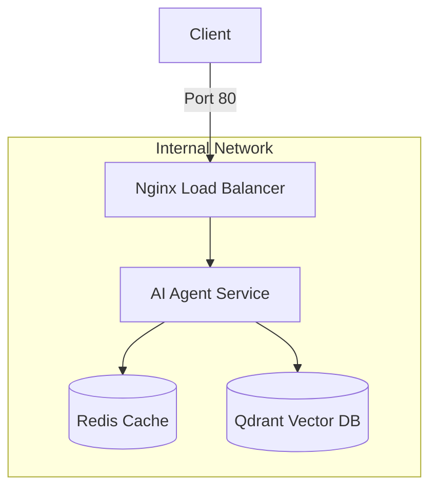

# Day 12 Lab - Mission Answers

## Part 1: Localhost vs Production

### Exercise 1.1: Anti-patterns found
1. API key hardcode trong code: `OPENAI_API_KEY = "sk-hardcoded-fake-key-never-do-this"`. Nếu push lên GitHub là bị lộ secret.
2. Không có config management: Các biến như `DEBUG`, `MAX_TOKENS` bị fix cứng trong code, không linh hoạt theo environment.
3. Print thay vì proper logging: Log thông tin ra console bằng `print()`, thậm chí log cả API key (secret) ra log.
4. Không có health check endpoint: Platform không biết trạng thái của agent để tự động restart nếu app bị treo/crash.
5. Port cố định & Binding local: Cố định `port=8000` và `host="localhost"`. Khi deploy cần đọc port từ env var và bind `0.0.0.0`.

### Exercise 1.3: Comparison table
| Feature | Develop | Production | Why Important? |
|---------|---------|------------|----------------|
| Config  | Hardcode trong file code | Environment variables (via `.env` & Pydantic) | Bảo mật secret và linh hoạt thay đổi config mà không cần sửa code. |
| Health check | Không có | Có endpoint `/health` và `/ready` | Để container orchestrator tự động giám sát và restart nếu app lỗi. |
| Logging | Dùng `print()` đơn giản | Structured JSON logging | Dễ dàng parse và quản lý log tập trung; tránh rò rỉ secret vào log. |
| Shutdown | Tắt đột ngột | Graceful shutdown (SIGTERM handler) | Hoàn thành các request đang dở và đóng connection sạch sẽ trước khi terminate. |

## Part 2: Docker

### Exercise 2.1: Dockerfile questions
1. Base image: `python:3.11` (Đây là full Python distribution).
2. Working directory: `/app` (Thiết lập thư mục làm việc chính cho container).
3. Tại sao COPY requirements.txt trước? Để tận dụng **Docker layer cache**. Nếu code thay đổi nhưng dependencies không đổi, Docker sẽ reuse layer cũ thay vì phải chạy lại `pip install`, giúp build nhanh hơn.
4. CMD vs ENTRYPOINT khác nhau thế nào? `ENTRYPOINT` xác định lệnh chính không thể thay đổi của container, còn `CMD` cung cấp các tham số/lệnh mặc định có thể dễ dàng bị ghi đè khi chạy lệnh `docker run`.

### Exercise 2.3: Image size comparison
- Develop: 1.66 GB
- Production: 236 MB
- Difference: ~85.8% reduction

**Tại sao image Production nhỏ hơn?**
1. **Base Image**: Bản develop dùng `python:3.11` (đầy đủ, nặng ~1GB), trong khi production dùng `python:3.11-slim` (tối giản, chỉ chứa những gì cần để chạy Python).
2. **Multi-stage build**: Tách biệt quá trình build và runtime. Stage builder cài các công cụ nặng (gcc, build-essential) để biên dịch thư viện, nhưng Stage runtime chỉ copy kết quả cuối cùng, loại bỏ hoàn toàn các file rác và công cụ build.
3. **Dọn dẹp**: Production Dockerfile xóa cache apt (`rm -rf /var/lib/apt/lists/*`) và dùng `--no-cache-dir` khi install pip.### Exercise 2.4: Docker Compose stack

**Architecture Diagram:**

**Services được start:**
1. **agent**: AI Agent (FastAPI) xử lý logic chính.
2. **redis**: Lưu trữ session và hỗ trợ rate limiting.
3. **qdrant**: Vector Database dùng cho các tác vụ RAG (Retrieval-Augmented Generation).
4. **nginx**: Đóng vai trò Reverse Proxy và Load Balancer, là cổng vào duy nhất từ internet.

**Cách chúng communicate:**
- **External to Internal**: Client gửi request qua port 80 tới Nginx.
- **Internal Routing**: Nginx chuyển tiếp request tới các instance của service `agent`.
- **Service-to-Service**: Agent kết nối tới Redis và Qdrant thông qua tên của service (Docker DNS tự động phân giải IP).
- **Isolation**: Tất cả các service giao tiếp trong network `internal`, giúp ẩn các database (Redis, Qdrant) khỏi internet để bảo mật.

## Part 3: Cloud Deployment

### Exercise 3.1: Railway deployment
- URL: https://deployrailway-production-e1a3.up.railway.app/
- Screenshot: [Link to screenshot in repo]

### Exercise 3.2: Deploy Render
- URL:
- Screenshot: 

## Part 4: API Security

### Exercise 4.1-4.3: Test results
[Paste your test outputs]

### Exercise 4.4: Cost guard implementation
[Explain your approach]

## Part 5: Scaling & Reliability

### Exercise 5.1-5.5: Implementation notes
[Your explanations and test results]